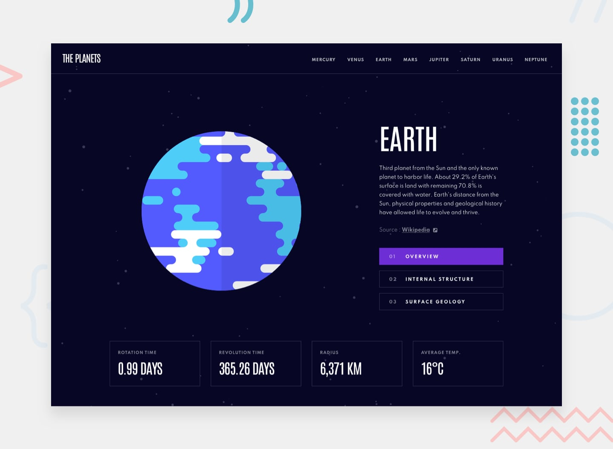

# Planets fact site

## Welcome! 👋

This is one of my pet-projects, from Frontend Mentor platform. Technologies I used: React, Typescript, react styled-components, react-router-dom

## The challenge

The challenge was to build out this 8-page planets fact site and get it looking as close to the design as possible.

Local `data.json` file for the planets was provided and I was able to pull the data from there instead of using the separate components.

Users are able to:

- View the optimal layout for the app depending on their device's screen size
- See hover states for all interactive elements on the page
- View each planet page and toggle between "Overview", "Internal Structure", and "Surface Geology"

## Deploying project

The project is hosted on:

- [Vercel](https://vercel.com/)

**Have fun discovering interesting facts about planets!** 🚀
